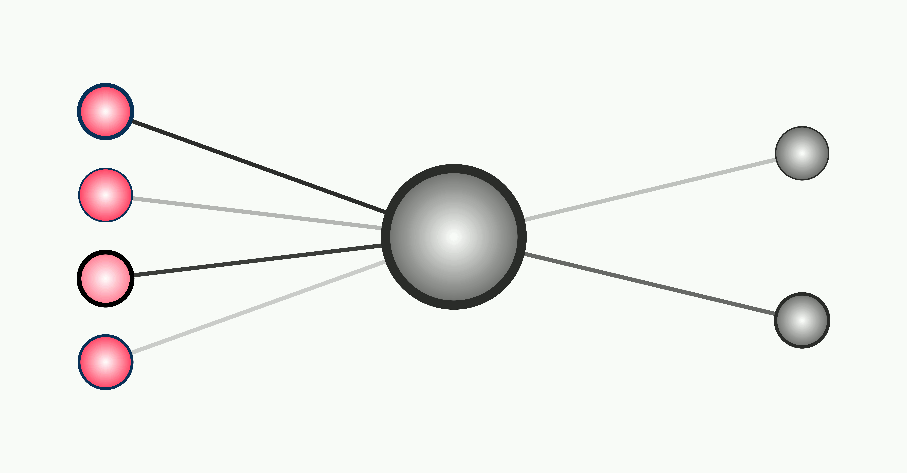
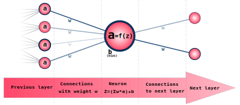
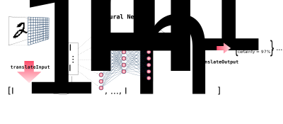
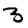
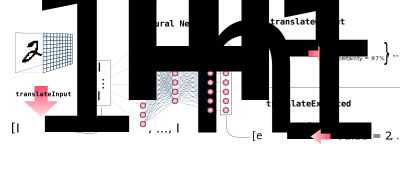
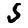
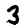

# Building an Object Oriented Neural Network

The basic concept of a Neural Network fits so nicely into the object-oriented programming paradigm and yet
most of the sample code we find online in tutorials looks ugly, old-fashioned procedural and difficult to read.  


Let's see if we can build a nice, clean Object-Oriented Neural Network from scratch.
With code that really reflects the neural theory.

I already learned the basics of neural networks in the early 1990's 
and did quite some experiments with AI and ML. But with the recent wave of new AI tools appearing everywhere, 
I wanted to really know and understand more of the low-level details. 
The basic concept of a neural network is nicely explained and illustrated in this [3blue1brown](https://www.youtube.com/watch?v=aircAruvnKk&list=PLZHQObOWTQDNU6R1_67000Dx_ZCJB-3pi) video series.
The links under the video led me to Michael Nielsen's [online book](http://neuralnetworksanddeeplearning.com), which explained some more details.
If you're new to neural networks, I would advise you to first watch the video's or read the first (or first 2) chapter in the online book.

Although I really liked the explanation of how such a network works, I found the code samples and  
the [accompanying python code](https://github.com/mnielsen/neural-networks-and-deep-learning/tree/master)
(of course python, what else... later more on that...) quite confusing and difficult to fully comprehend and match with the theory.

Coming from a Java and Javascript background, the code is not as cleanly structured and nicely encapsulated as I'm used to.
A crucial concept like 'neuron' doesn't even appear anywhere in the code itself, only in the comments.
The main feed-forward algorithm is coded as

```python
    def feedforward(self, a):
        """Return the output of the network if ``a`` is input."""
        for b, w in zip(self.biases, self.weights):
            a = sigmoid(np.dot(w, a)+b)
        return a
```
It works, sure, but to me, this code doesn't reflect what the feed-forward algorithm really is.  



Because they are based on a biological-physical model or metaphor, neural networks are naturally suited to be implemented elegantly using an object-oriented programming paradigm. 
However, most examples use a dense, procedural, and even ugly, coding practice.

I did a quick google search to see if I could find better, nicer looking implementations, but I was quite disappointed with the results.
Some [articles](https://towardsdatascience.com/understanding-and-implementing-neural-networks-in-java-from-scratch-61421bb6352c)  and [videos](https://www.youtube.com/watch?v=NWQETJz8fII) have promising titles, but when the presented code starts with an array of arrays called 'w'
it's not going to fit in my view of clean, readable code. 
This impression was further endorsed when the article concludes: 
> Being a fellow Python programmer I was not very comfortable with Java

Yeah, I could have guessed...

I didn't look any further - I'm sure there must be some nice implementation examples somewhere -
but instead I decided to just try it myself and share it here. I hope this article will clarify what bothers me
about the code samples I found and offer an alternative reference for other people.

## Like we're living in the matrix 
Most implementations of a neural network implement the calculations as matrix and vector operations.
Some people think that's nice and convenient and allows us to use speed-optimized libraries to do the basic calculations. 
But it doesn't exactly make the code more transparent or readable. 
The fact that you can multiply a and b where it doesn't matter if a and b are just numbers or vectors or matrices might 
be convenient for the programmer himself. It's certainly not easier to read for others.

Above all, the purpose of articles like these is to teach us something. 
The sample code should be an illustration and a clarification of the mathematical and computational theory.
In most cases, however, the code reflects an alternate, matrix oriented, view on the implemented algorithms.

The program doesn't represent a neural network like it is explained in all those fancy pictures, inspired by the neurons we find in our brain.
Instead, it mimics something else, that can be shown to be a mathematically equivalent model to the explained neural network.

But, especially in an educational context like the articles and video's mentioned, I'd rather see code that really reflects this brain analogy.
I don't want an illustration of an equivalent alternative. I want to see the real thing. 
The working network! Neurons! Synapses! Signals!

## Performance
Of course, I know, I know, performance!!!  
The strongly dominant narrative here is that we really need to translate our algorithms to a vector and matrix approach
so that we can use these fancy, speedy matrix libraries that do the magic much quicker than our lousy, slow program. 
As if neural networks need more, confusing, hocus pocus than there already is. And GPU's oh yeah! GPU's! an extra opacity layer, everyone seems to love.

The how, and why behind the functioning of neural networks work is already a mystery, even to most of the people programming and using them. 
We're not going to benefit from an extra layer of black box obscurity.

The code examples in these articles have an educational, illustrative purpose. They shouldn't focus on performance.

Using matrix calculations in introductory articles and tutorials on AI is a perfect example of [premature optimization](https://xkcd.com/1691/).
It's perfectly possible that the matrix approach is absolutely necessary to build the large scale AI tools we see popping up everywhere recently.
But actually, we simply don't know if we don't try it out. 
It might well be possible that the matrix idiom leads us to a programming tunnel vision that poses its own limitations and boundaries
that are currently not questioned.  The matrix calculations, besides giving us a supposed speed boost, limit our creativity and mental freedom.

> But I don't like to be limited in my creativity!

Let's say eg. that I want to see what happens when layers are not fully connected.
I want to connect the neurons to the previous layer based on some positional property of the neurons. 
After all, the example that we will use with the images is 2D, but we try to process them, suboptimally, as one long array.
The same basic idea we see in so-called convolutional networks, but that's again very much matrix oriented. 
Maybe my simplistic idea of non fully connected layers might turn out to be totally useless. 
But in the matrix approach, I lack the possibility to just simply try it out and experiment with it. 

To rephrase this in the typical neural lingo: the matrix approach inherently contains the danger
of being stuck in a local minimum in our search to solving real world problems.

Anyway, for the rest of the article I'll try to avoid the performance issue and focus on programming elegance and clarity. 
I'll discuss performance tuning in a next article. 
Spoiler: the matrix approach might not be orders of magnitudes faster after all. 
The issue is at least a bit more complicated.

## The python trap
One more paragraph of critique and negativity, before we turn to the object implementation. 
You might want to skip this paragraph if you like python ;-)

A lot of the AI/ML applications are implemented in python.  
The unfortunate thing is that python actually is a slow, [bad programming language](https://medium.com/nerd-for-tech/python-is-a-bad-programming-language-2ab73b0bda5) and even 
bad for the [environment](https://greenlab.di.uminho.pt/wp-content/uploads/2017/10/sleFinal.pdf).
It's a bit strange that python made it as the almost default language for AI/ML and data analysis.
A programming language is not good or bad on its own, but its quality largely depends on how and where it is applied.
Apart from the remarks made in the article, I often noticed that python enables or even encourages bad programming habits. 
Partly because python itself is so slow, programmers habitually give up code clarity over presumed speed gains.

If we look at the python code examples from [neuralnetworksanddeeplearning](https://github.com/mnielsen/neural-networks-and-deep-learning/tree/master/),  
I have the impression that quite some design choices are made because of supposed speed optimization.

- The Cost function itself, while being such a crucial part of the training process, isn't even implemented at all. Not even as an illustration.
- The feed forward routine, the basic routine of the network, on the other hand, is implemented twice.
Once as the feedforward routine itself and once again inside the backprop routine. 
I guess that's because in the feedForward, the Z values (the weighted sum of incoming neurons, before the activation function is applied) 
are not stored in memory. However, in the backpropagation routine, we do need the neurons' Z values.
So we end up with one version that stores these values and another one that calculates the neurons' output in one go.
If you try it out, however, the assumed optimization by leaving out storing the Z values is simply non-existent.
This [duplicate code](https://en.wikipedia.org/wiki/Duplicate_code) is a violation of the [DRY principle](https://en.wikipedia.org/wiki/Don%27t_repeat_yourself).
This is especially important because those few lines are the absolute center of the whole Neural Network.


## OO Javascript implementation
So, how did I implement my Neural Network? 

I won't explain the meaning of the different neural network concepts and terminology. 
As said before, read [the book](http://neuralnetworksanddeeplearning.com) and watch the videos. To make it easy to compare, I will be focusing on the exact same example network as in the first 2 chapters of the book and the videos.
A completely connected network with 1 hidden layer (30 neurons) and 10 output neurons to recognize written numbers, trained on the [MNIST dataset](https://yann.lecun.com/exdb/mnist/).
(There seems to be something wrong with the original website, but you can download the dataset at several other locations, like [Kaggle](https://www.kaggle.com/datasets/hojjatk/mnist-dataset))

Let's implement this network in node / javascript without any dependencies, with a focus on clean, readable and nicely encapsulated OO code. 
As already mentioned, we won't be focusing on performance, but it might guide us in certain implementation decisions, as long as it doesn't interfere with readability.
In the various loops and propagations, we will be mixing a recursive and an iterative approach, depending on what's most obvious or clean.
Also, we prefer to use the dedicated array looping functions like forEach, map and reduce over old-fashioned for() iteration.   

### Neuron
We'll use a bottom up approach and start with the Neuron itself. 
After all, just like in the brain analogy, the network is just an emergent concept that simply holds together a bunch of neurons. 
The network itself gets its functionality and power from the complex combination of intertwined neurons, who are doing most of the work. 
Obviously, at the basis of the code is the Neuron class.
(Well, obviously? Then why do most sample implementations don't even have a Neuron class???)

The Neuron class keeps the values (outputvalue a and z), the neurons' bias and a list of connections to the previous and next layer.



```javascript
let neurons = 0

class Neuron {
    constructor() {
        this.id = (neurons++)
        this.in = []
        this.out = []
        this.activate = sigmoid
        this.value = null  // a
        this.bias = getRandom()
        this.z = 1.0
    }

    connectLayer(layer) {
        layer.forEach(other => new Connection(other, this))
    }

    reset() {
        this.value = null
        this.delta = null
    }

    feedForward() {
        this.z = this.in.reduce((previous, conn) => previous + (conn.weight * conn.in.getValue())
            , this.bias)
        this.value = this.activate(this.z) // sigmoid
    }

    getValue() {
        if (this.value === null) {
            this.feedForward()
        }
        return this.value
    }
}
```

The connectLayer function creates the (fully connected) network structure by connecting the Neuron to the previous layer by using a Connection object.
A Connection (or should we call it Synapse) has an input neuron, an output neuron and a weight value.
You could code this with an implicit Connection object, but, especially when we add the training code, it's cleaner if we also code the Connection as a separate class.

```javascript
class Connection {
    constructor(input, output) {
        this.in = input
        this.out = output
        this.weight = getRandom()
        input.out.push(this)
        output.in.push(this)
    }
}
```
When a neuron is in reset state (value === null), feedForward() will calculate the weighted sum of the values of the previous layer (this.in) and add the bias value of the neuron.
This weighted sum is stored in this.z, after which a so-called activation function is applied to get the output value of the neuron. 
The getValue function checks if the value for this neuron is already calculated and if not, calls the feedForward function.
At first this mechanism might look a bit strange and backwards to people who are used to the more classical forward moving implementation.
Later on, we will show that this recursive, backwards approach can be changed to a forward one (with a certain extra speed gain) by simply adding a single line of code. 
But I do think this implementation has a certain beauty in it, that might become clear when we try out some more experimental designs.

There are several possible ways to calculate this weighted sum, but for now we think the reduce function makes the code quite elegant.
For people less used to the functional reduce approach, the alternative can be a more classical for() loop
```javascript
        this.z = this.bias;
        for (let i=0;i<this.in.length;i++) {
            let conn = this.in[i]
            this.z +=  ( conn.weight * conn.in.getValue())
        }
```
or 
```javascript
        this.z = this.bias;
        for (let conn of this.in) {
            this.z +=  ( conn.weight * conn.in.getValue())
        }
```

### Unit tests
Clean code and proper encapsulation leads to better testability and more maintainable code.
The nice thing of having cleanly encapsulated code is that it makes it easier to write unit tests.   
I admit that in my own projects, I wasn't always a diligent writer of unit tests. 
Now I just tell my editor-assistant that he's a rock-star javascript programmer and ask him to write me the tests, like
```javascript
import Neuron  from '../lib/neuron.js';

describe('Neuron Class', () => {
    let hiddenNeuron;
    let inputNeuron;

    beforeEach(() => {
        inputNeuron = new Neuron();
        hiddenNeuron = new Neuron();
        hiddenNeuron.bias = 0.2
        let weights = [0.5,0.6,0.7]
        let values = [1,0,1]
        let input = [new Neuron(), new Neuron(), new Neuron()]
        input.forEach((n,i)=>n.value=values[i])
        hiddenNeuron.connectLayer(input,weights)
    });
     
    test('it should instantiate the Neuron class correctly', () => {
        expect(hiddenNeuron).toBeInstanceOf(Neuron);
    });

    test('reset method should reset value and delta', () => {
        hiddenNeuron.value = 5;
        hiddenNeuron.delta = 3;
        hiddenNeuron.reset();
        expect(hiddenNeuron.value).toBeNull();
        expect(hiddenNeuron.delta).toBeNull();
    });

    test('isInput returns false if neuron has input', () => {
        expect(hiddenNeuron.isInput()).toBeFalsy();
    });
    test('isInput returns true if neuron has no input', () => {
        expect(inputNeuron.isInput()).toBeTruthy();
    });
    test('isOutput returns true if neuron has no output', () => {
        expect(hiddenNeuron.isOutput()).toBeTruthy();
    });

    it('should calculate correct value', () => {
        hiddenNeuron.feedForward();
        let expectedZ = 1.4 // (0.5×1+0.7×1+0.2)
        let expectedA= 0.8021838885585817 // 1/(1+ exp(-(0.5×1+0.7×1+0.2)))
        expect(hiddenNeuron.z).toEqual(expectedZ);
        expect(hiddenNeuron.value).toEqual(expectedA);
    });
    
    // .....
    // additional tests
})
```

### NNet
The last class we need is the Network itself to keep the whole structure together
and provide the input and output functions and some additional decoration methods.

```javascript
import Neuron from "./neuron.js";

class NNet {
    constructor(inputSize) {
        // keep a list of all neurons
        // makes it easier to clone and serialize
        this.allNeurons = []
        this.output = this.input
        this.count = 0
        this.input = this.addLayer(inputSize)
        // keep a list of hidden and output neurons
        // makes it easier to reset and feedForward
        this.neurons = []
    }
    
    addLayer(size) {
        let layer = Array.from({length: size}, (n1, i) => {
            let n = new Neuron()
            this.allNeurons.push(n)
            n.connectLayer(this.output)
            return n
        })
        this.neurons.push(...layer.filter(n=> !n.isInput())) // add all non input neurons        this.output = layer
    }

    reset() {
        this.allNeurons.forEach((n, i) => n.reset() )
    }

    feed(input) {
        this.count++
        this.reset()
        this.input.forEach((n, i) => n.value = input[i])
    }

    getOutput() {
        return this.output.map(n => n.getValue())
    }

    // convenience / decoration methods
    translateInput(value) {
        // allow translate of any object to list of values
        // default do nothing
        return value
    }

    translateOutput(value) {
        // allow translate of list of values to object
        // default do nothing
        return value
    }

    check(item) {
        this.feed(this.translateInput(item))
        return this.translateOutput(this.getOutput())
    }
}
```
The NNet object mainly keeps an input and an output array of Neurons and some counters and network parameters.
It's possible to implement the network with only the input and output and no direct access to the neurons in hidden layers, 
but it's easier for routines like reset if we do keep a list of neurons. 
- this.neurons lists the neurons of the hidden and output layers.
- this.allNeurons is a convenience variable that keeps a list of all the neurons of the whole network.
It could also be implemented as ``[…this.input, … this.neurons]``

When we create a new Network we only create the input layer and make the output layer also point to the input layer. 
addLayer (you might have guessed) adds a new layer to the network, fully connected to the previous last layer. 
The last layer added is automatically the output layer.

At the low level, a feed forward is done by:
- resetting all neurons
- copying the input vector (with the size of the input layer) to the values of the neurons of the input layer
- reading the values of the output layer (getOutput) which recursively performs a feedForward() for all the neurons of the network.

To decorate this, there are 2 methods that default to 'do nothing' but can be used to transform an input object to a correct input array (translateInput)
or to interpret the meaning of the output array into a meaningful result.

In our example with the handwritten numbers, translateInput could convert an image to a predefined size and convert the 0-255 grayscale integers to an array of 0-1 doubles.
TranslateOutput can be used to identify the largest value in the output vector and return that index as the final answer of the network.

The check method simply combines translateInput -> feed -> getOutput -> translateOutput.



Now the neural network is in theory fully functional, but we can't yet show this, because there's no training mechanism or an option to load pre-trained networks. 

## Training code
Training the network means gradually adjusting the neurons' biases and all the connections' weights until the whole network gives us the desired output for a given input.
So, after training, when we add the grayscale pixel values of a 28x28pixels image like

we can expect something like [0.000,0.001,0.001,0.919,0.000,0.004,0.000,0.000,0.000,0.000] as an output. 
Since the fourth value is clearly the largest, the system gives a correct answer: 3.

We can train our network by feeding it (lots of) images for which we already know which number they represent (so called labeled images) 
and each time tweak the biases and weights a bit so that the next time the network hopefully performs a little bit better.
The MNIST dataset is a big list of images (70000) that are already labeled. 

To adjust all the values, we use the technique called Stochastic Gradient Descent (SGD). 
Once more... be sure to watch the [videos](https://www.youtube.com/watch?v=aircAruvnKk&list=PLZHQObOWTQDNU6R1_67000Dx_ZCJB-3pi).
Although the overall principle is clearly laid out, the fine details are sometimes a bit harder to fully understand (What is a mini-batch anyhow?). 
It contains a lot of vectors and derivatives, things that are not always obvious to everybody .
I hope my code can help in understanding these details.

When we feed a training sample image to the network, we compare the output of the network to the expected value,
and adjust the weights and biases from the output layer backwards through the network.
The comparison of the output values to the expected values is what we call the cost function. 
The cost as the mean quadratic difference between output and expected values can be calculated like this:. 

```javascript
    // in class NNet
    getCost(){
        return this.output.reduce((previous,n,i)=> 
            (previous + (Math.pow((n.expected - n.value),2 ) / (2*this.output.length))) , 0)
    }
```

Finding the optimal weights and biases of the network is where this (highly dimensional) cost function reaches a (local) minimum. 

The weights and biases are typically not adjusted for every training sample. 
Instead, we accumulate the so-called delta values for the weights and biases for some amount of samples (the mini batch).
When all the samples in the mini batch are evaluated, we adjust the values (learn) by moving a certain amount (this.step)
in the direction the aggregated delta's show us (=the opposite of the average gradient) and start a new mini batch.
Again, the main code for evaluating and adjusting the values is done inside the Neuron and Connection objects.

### Train NNet
For the NNet, the training routine is 
- Feed the training sample image to the input layer and through the network.
- Assign the expected values to the output layer
- Calculate the cost function as the difference of the output values and expected values.
- Have the neurons evaluate the difference of expected and actual output values recursively, and accumulate this delta value.
- When a training batch is complete, the actual learning happens by letting the neurons and connections adjust their biases and weights.

For the NNet class we need 2 extra variables: the step and the batchSize. The NNet train method is just 
```javascript
    // in class NNet
    this.step = 3
    this.batchSize = 10
    // translate the expected label to an ideal vector representation
    // default is do nothing
    translateExpected(expected){
        return expected
    }
 
    train(item, expected){
        this.trainings++
        // feed forward the training item
        let output = this.check(item)
        // store the expected values in the output neurons
        let expectedVector = this.translateExpected(expected)
        this.output.forEach((n,i)=> {n.expected = expectedVector[i] })
        let cost = this.getCost()
        // 'back' propagate           
        this.neurons.forEach((n)=>n.getDelta())

        if (this.trainings % this.batchSize == 0){
            this.neurons.forEach((n)=>n.learn(this.step/this.batchSize))
        }
    }
```
In reality, the code is a bit longer, since we want to keep some extra counters and timings, and store the cost value in a circular array (see infra),
but this is the main routine. Again, the approach is quite a bit different from Nielsens' code.

Instead of feeding a batch of samples to the training method, I simply iterate over all values and call train() for every single sample. 
The batchSize is a parameter that belongs to the network itself, not to the calling object. 
The network itself can keep track of when a mini batch is complete and perform the learning adjustments accordingly.



I can perfectly understand if some people don't like forwardish recursive forEach call.
In that case, you can replace it with a backwards counting loop like  
```javascript
        for(let i=this.neurons.length-1 ;i>=0;i--){
            this.neurons[i].getDelta()
        }
```
But actually, it doesn't really matter. The getDelta function (as we'll see shortly) is recursive and will propagate the calculations
through the network and calculate all values in the correct order anyhow.

## Train Neuron
Now for the neurons, we need to implement the getDelta (accumulate the differences) and learn methods (adjust weights and biases) where the real work is done.
If I interpreted the original python code correctly, this should become something like:


```javascript
class Neuron {

    constructor() {
        /*  previously defined variables */
        this.actDeriv = sigmoidDeriv
        this.delta = null
        this.deltaSum = 0.0
    }

    /* previously defined methods*/
    
    getDelta() {
        if (this.delta === null) {
            if (this.isOutput()) {
                // output neurons  
                this.delta = ((this.value - this.expected) * this.actDeriv(this.z))
            } else {
                // hidden neurons
                this.delta = this.out.reduce((previous, conn) => previous + (conn.out.getDelta() * conn.weight), 0)
                    * this.actDeriv(this.z)
            }
            this.in.forEach((conn, i) => {
                conn.setDelta(this.delta)
            })
            this.deltaSum += this.delta
        }
        return this.delta
    }

    learn(batchStep) {
        if (this.delta) {
            // adjust bias
            this.bias -= batchStep * this.deltaSum
            // adjust input weights
            this.in.forEach((conn, i) => {
                conn.learn(batchStep)
            })
            this.deltaSum = 0
            this.delta = null
        }
    }

    /*
    Extra info methods
     */

    isInput() {
        return this.in.length == 0
    }

    isOutput() {
        return this.out.length == 0
    }
}
```

The Neuron.getDelta() method calculates and accumulates the delta value in every neuron.
- If the neuron is an output neuron, delta is just the difference between the output value and the expected value multiplied by the derivative of the activation function.
- For other neurons (the hidden layers), delta is the weighted sum of the delta's of the next layer, again multiplied by the activation derivative. 
- This delta value is propagated to all the incoming connections where each connection also keeps an accumulating delta adjusted for the incoming neuron's value. 

The learn method simply adjusts the neuron's bias, calls the learn method for all incoming connections and resets the accumulated delta values.

```javascript
class Connection {
    constructor(input , output){
        /* previously defined variables*/
        this.deltaSum= 0
    }
    setDelta(delta){
        this.deltaSum += delta * this.in.getValue()
    }
    learn(batchStep){
        this.weight -= batchStep * this.deltaSum
        this.deltaSum=0
    }
}
```

That's it. This code is now the basic building blocks of our simple Neural Network library.

### training the handwritten numbers 

Now we can try out if we can make the network recognize the handwritten MNIST numbers, our original goal.

```javascript
import {NNet} from "../index.js";
import {getImages,getTestImages} from "./readImages.js";

const net = new NNet(28*28)

function run() {
    net.step = 3
    net.batchSize = 10
    net.epochs = 3
    net.addLayer(30)   // hidden
    net.addLayer(10)  // output
    // translate a 0-9 number to a vector where the n'th position is a 1
    net.translateExpected = (expected) => {
        let result = new Array(10).fill(0, 0, 10)
        result[expected] = 1
        return result
    }
    net.translateInput=  (v)=> v.map(item=> item/256 ) // depends on the version of the reader code
    // get index of highest value
    net.translateOutput= (output)=> {
        let result = {}
        result.label = output.reduce((previous, val, i, arr) => val > arr[previous] ? i : previous, 0)
        result.score = output[result.label]
        result.output = output
        return result
    }     
    
    train(50000)
    check(10000,true)
}

function train(size){
    console.time("train")
    let startTime = Date.now()
    let images = getImages(0,size)
    for (let epochs=0;epochs<net.epochs ; epochs++) {
        images.forEach(image=>{
            net.train(image.pixels, image.label) 
            // monitor decreasing cost
            if (net.trainings%10000==0){
                console.log("train "+net.trainings+"  Cost "+net.getAverageCost(10).toFixed(5))
            }
        })
        check(1000,false)
        console.log("epoch "+epochs+"  Cost "+net.getAverageCost().toFixed(5) )
        net.trainTime = Date.now() - startTime
        console.timeLog("train")
    }
}

function check(count,show){
    if (show) console.time("check")
    let startTime = Date.now()
    let start = Math.floor(Math.random()*(10000 - count))
    if (show) console.log("test images "+start+" "+count )
    let testImages = getTestImages(start,start+count)
    let correct = 0
    testImages.forEach((image,n)=>{
        let result = net.check(image.pixels)
        if(image.label == result) correct++
        if (show) console.log(((image.label == result)?"check ":"MISS ")
            +i+" "+image.label+"  <=> "+result.label+"  "+result.score.toFixed(4)+"   "+ output.map(r=>r.toFixed(3)))
    })
    if (show) console.log("Training iterations "+ net.trainings+"  TrainTime "+net.trainTime+" "+(net.trainings/(net.trainTime/1000)).toFixed(2)+" Trainings/s " + net.step +" step")
    if (show) console.log("Training step:"+  net.step +"   BatchSize: "+net.batchSize)
    if (show) console.log("Check iterations "+ count+" "+(1000*count/(Date.now()-startTime)).toFixed(2)+" Checks/s ")
    console.log("success rate "+ (correct/testImages.length).toFixed(3))
    if (show) console.log("Avg Cost "+ net.getAverageCost().toFixed(5))
}

run()

```
What the program does is:

- We create a neural network with 28*28 input neurons,
- add a fully connected hidden layer of 30 neurons,
- add a final layer (output) of 10 neurons.
- The translateInput function takes an image and translates the 0-255 grayscale integer pixels to 0-1 double values
- The translateOutput function looks for the highest value in the output vector and returns an object that contains
the index of the highest value (label), the value itself as an estimate of how well the number was recognized
and the output vector itself. There might be better indicators for accuracy, but for now this seems fine.
- TranslateExpected, as it is the inverse function of translateOutput, converts a 0–9 number to an array of all zeros, except the n'th item, which is a one
- Read the labeled image data  (I actually don't like this. It looks too pythonesque to load the whole dataset into memory, but I wanted to follow the same approach)
- The image data is an array that contains {label, pixels} objects. Pixels is a 784 array of 0-255 grayscale values.
- One by one, send this image data, together with the label, to the network to train it.
- Every 10000 images, we monitor the current average cost function result
- After each epoch, we check 1000 test images to check the current success rate


- After x training epochs, all 10000 test images are tested and each result is shown in the console. 
For every test image, which are new to the network because they don't belong to the training set, 
the basic recognition info (hit or miss, numbers, output vector) is displayed.

It looks like the network is really learning, since the average cost is mostly decreasing.
After the first epoch of 50000 training images, the success rate, based on 1000 random test images, is 90.2%. 
On my computer, one training batch of 50000 images takes 12-15s to complete, which is not bad.
After a few training epochs we see final success rates in the range 92%-97%, which shows that the network is performing as it should.


It's especially interesting to see the details when the network makes a mistake.

In our example images 9982  and 9986  are wrongly interpreted. In this case as a 6 and an 8 respectively.
The relatively low values (0.765 and 0.385) in the output vector reflect the insecurity of these results. 

You're all invited to download the code at the [repository](https://github.com/darlingVandamme/OONeuralNetwork), try it out and experiment with it.


## Some extra's

In the code you can see some additional features that have not yet been discussed here.
These are not strictly needed but it might be interesting to give a bit more information here. 

###  Forward feedforward
I mentioned before that the main feedforward algorithm might seem a bit backwards / recursive.
Although I still think this approach looks nice and might have some interesting advantages in the future, if we just add 1 line of code like: 
```javascript
    // in NNet
    feed(input){
        this.count++
        this.reset()
        this.input.forEach((n,i)=> {n.value = input[i]})
    // add this:
        this.neurons.forEach((n,i)=>{n.feedForward()})     
    }
```
the neurons evaluate their state in forward order, and it actually speeds things up quite a bit, since there's less unneeded recursive method calls.

### readImages
The MNIST dataset is split into 2 times 2 files. At least the version I downloaded. 
One file contains the 0-255 grayscale pixel values of the images. Another file contains the labels, the number the corresponding image represents. 
There's one fileset for the 60000 train images and one set of 10000 test images. 
I just read the 2 files and store all the images in 1 array of 70000 image objects.
The brute force approach of synchronously reading all data in memory and then sending that to the network doesn't feel nice. 
It won't scale when the training data becomes larger and might not fit in memory.

### Cost function circular array
After each training input, the cost function is calculated and stored in a circular array.
I don't want to keep an array of millions of training samples, but simply keeping the most recent 500 or so 
results in an array can give us an indication how the training is evolving.

At first, I added a boolean calculateCost variable, to specify whether I should calculate the cost of every training iteration or not. 
It turned out to be a premature optimization as well. Calculating the cost of every training iteration surely adds some extra load on the system,
but it's hardly measurable. The overall timings stay in the same range, so I dropped this variable and calculate the cost anyhow.
Instead of choosing the number of training epochs in advance, watching the cost evolution allows us to decide at what point,
extra training samples don't make the network perform any better, and so we can stop the training session or make other optimizations.

```javascript
class NNet{
    constructor(inputSize){
        // previously defined variables
        this.costs = []
        this.costIndex=0
        this.costsSize = 500
    }

    train(item, expected){
        /* ..... */
        this.output.forEach((n,i)=> {n.expected = ....

        this.costIndex = this.trainings % this.costsSize
        this.costs[this.costIndex] = this.getCost()
        /* ....*/ 
    }

    getAverageCost(){
        return this.costs.reduce((previous,cost)=> previous+cost ,0)/this.costs.length
    }
```

### serializing / deserializing
Of course, it's a waste of time and energy if we always have to retrain our networks when we need them. 
We should have some mechanism of storing the trained network in a file or database, and use the pretrained network when we need it.
Serializing / deserializing or cloning is also important if we want to parallelize the training or checking process.
As much as I like the clean OO network approach, I have to admit that it's much simpler to serialize/save/clone a network when it's simply an array of arrays.
When the network is a real network of neurons, massively linked to each other, serialization is not that easy.

Which might be a good thing. From a more philosophical point of view, it doesn't feel very brain-like if the network is easy to save or clone. 
Complexity, which is the driving condition for thinking, intelligence and consciousness, is more than just a list of numbers.

The best approach to serialize the network is giving each neuron an ID, equal to the index the neuron has in the allNeurons vector.
Then we can translate the input (and output) array(s) to a list of neuron ID's instead of neuron objects. 
This allows us to later reconstruct the network in an identical state.
The current codebase doesn't yet include serialization.

### Classifier
Apart from the network that reads number images, there's also another, very simple sample network. 
It doesn't really have any meaning, but it can be used to test if the network code is working properly. 
It's a very small network, 5 input neurons, 10 in a hidden layer, and 2 output. 
The network is trained on some combinations of 5 input values, like [1,0,0,2,1] and these are linked to either output [1,0] or [0,1].

Even with this basic simple network, we see wonderful concept that the network can assign a correct output to input patterns that are new, but resemble the trained patterns like [1,0,0,2,2].

### Java
Parallel to the javascript example, there's also a java implementation. 
The java code follows most of the assumptions and rules we discussed above and looks very much the same as the javascript samples. 
It would be great to further extend this to other languages as well. 
C#, Go, Ruby, Scala, Object-C .... 
But I'm also thinking about implementations in SQL or MongoDB aggregation pipelines.
- Implement the handwriting neural network 
- Make the code as clean as possible, with this javascript or java code as a guide.
- Encapsulate the code in Neuron, Connection and NNet classes or similar
- Don't focus on performance if it impacts readability

I look forward to your contributions, so that we can create a whole list of clean sample implementations.


